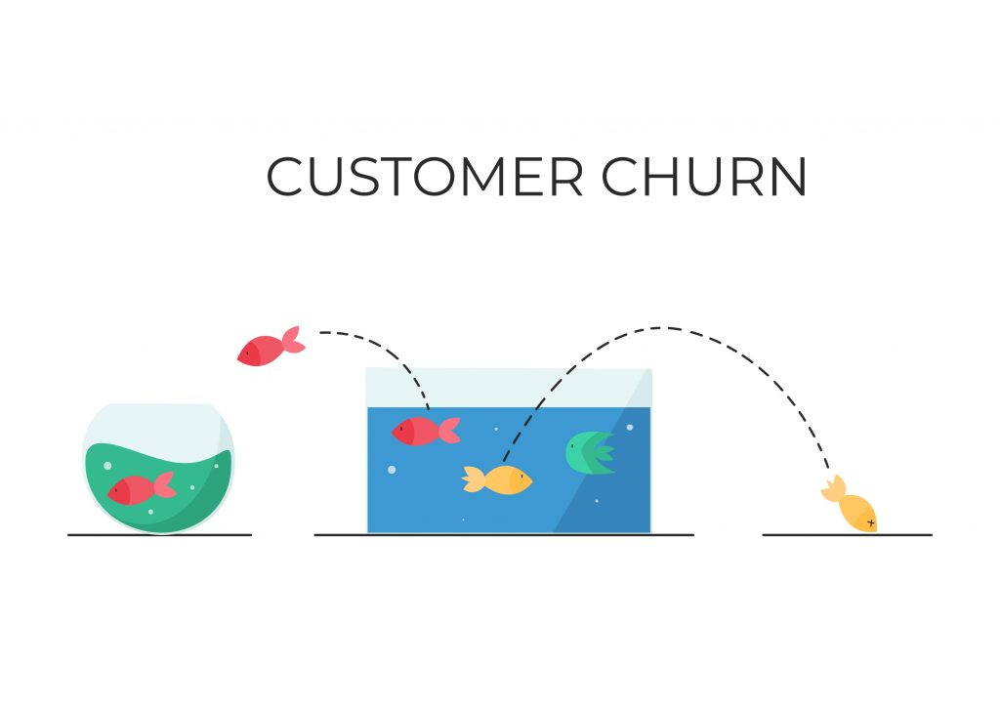

# Análise de Churn, aonde atuar para reter clientes e em quais clientes atuar?

## Problema de Negócio
Uma operadora de telecomunicações necessita de uma análise para a área de vendas da empresa com o intuito de reduzir a taxa de evasão de clientes, conhecido como **taxa de churn**. A **taxa de churn** indica quanto a empresa perdeu de receita ou de clientes em um certo período de tempo.

No atual cenário empresarial altamente competitivo e dinâmico, a retenção de clientes emergiu como um dos principais desafios enfrentados pelas organizações. Uma métrica crucial que auxilia as empresas a entenderem e abordarem esse desafio é a **taxa de churn**, também conhecida como taxa de rotatividade de clientes. A **taxa de churn** é um indicador que mede a proporção de clientes que deixaram de fazer negócios com uma empresa durante um determinado período, em relação ao número total de clientes que a empresa possuía no início desse período. Em outras palavras, ela quantifica a perda de clientes ao longo do tempo.

A **taxa de churn** é uma métrica crítica para as empresas, independentemente do setor em que operam, pois a retenção de clientes é essencial para o crescimento sustentável e a lucratividade a longo prazo. Uma **taxa de churn** alta pode ser um sinal preocupante, indicando que os esforços de aquisição de clientes não estão sendo acompanhados por estratégias eficazes de retenção. Além disso, a aquisição de novos clientes é geralmente mais cara do que a manutenção de clientes existentes, tornando a redução do churn uma abordagem econômica sensata para maximizar os lucros.

Através da análise detalhada da **taxa de churn**, as organizações podem identificar padrões, determinar fatores que contribuem para a perda de clientes e desenvolver estratégias proativas para melhorar a retenção, aumentando assim a satisfação do cliente, a fidelidade à marca e a saúde geral do negócio.
  

  
## Objetivos
- **Identificação Proativa de Clientes em Risco de Evasão:**
Um dos principais focos deste projeto é desenvolver um modelo preditivo capaz de identificar de forma proativa os clientes que apresentam uma probabilidade mais elevada de deixar nossa empresa. Isso será realizado através da análise de características específicas extraídas de nossa base de dados. Ao antecipar quais clientes estão em risco de evasão, seremos capazes de direcionar esforços e estratégias de retenção de maneira mais eficaz, garantindo um relacionamento mais sólido e duradouro com nossa base de clientes.

- **Análise de Drivers de Churn para Melhoria da Retenção de Clientes:**
Outro objetivo crucial deste projeto é compreender a fundo as variáveis que têm maior influência no processo de evasão de clientes. Através de análises detalhadas, buscamos identificar as variáveis que desempenham um papel determinante na decisão dos clientes de deixar nossa empresa. Ao identificar esses pontos de impacto, poderemos desenvolver estratégias mais direcionadas e personalizadas, visando mitigar a taxa de evasão. Ao tomar medidas para abordar os fatores mais relevantes, esperamos reduzir significativamente a taxa de churn e fortalecer a fidelidade de nossos clientes.
  
## Dados
Os dados utilizados nesse projeto se encontram <a href='https://raw.githubusercontent.com/carlosfab/dsnp2/master/datasets/WA_Fn-UseC_-Telco-Customer-Churn.csv' target='_blank'>nesse link</a> e o notebook completo com as análises, treinamento e resultados se encontrem <a href='https://github.com/guicastrorl/alura_challenge_ds/blob/main/notebooks/notebook_crisp_ds.ipynb' target='_blank'>nesse link</a>.

A base de dados possui o número de identificação do cliente e se o cliente deixou ou não a empresa, e ainda, informações sobre:

- **customerID:** é o id único de cada cliente;
- **Churn:** indica se o cliente deixou de ser cliente da empresa ou não;
- **customer:** contém informações específicas do cliente que se subdividem em:
    - **Dependents:** se o cliente possui ou não dependentes;
    - **Partner:** se o cliente possui ou não parceiro ou parceira;
    - **SeniorCitizen:** informação sobre um cliente ter ou não ter idade acima dos 65 anos;
    - **gender:** gênero do cliente;
    - **tenure:** meses de contrato do cliente.
- **phone:** contém informações relacionadas aos serviços telefonicos do cliente:
    - **MultipleLines:** assinatura de multiplas linhas telefônicas;
    - **PhoneService:** assinatura de serviço telefônico;
- **internet:** contém informações relacionadas aos serviços de internet do cliente:
    - **DeviceProtection:** assinatura adicional de proteção do dispostivo;
    - **InternetService:** assinatura de um provedor de internet e qual;
    - **OnlineBackup:** assinatura adicional de backup online;
    - **OnlineSecurity:** assinatura adicional de segurança online;
    - **StreamingMovies:** assinatura adicional de serviço de streaming de filmes;
    - **StreamingTV:** assinatura adicional de serviço de streaming de TV;
    - **TechSupport:** assinatura adicional de suporte técnico.
- **account:** possui informações da conta do cliente:
    - **Charges:** possui informações dos encargos:
        - **Monthly:** encargos mensais;
        - **Total:** encargos totais.
    - **Contract:** tipo de contrato;
    - **PaperlessBilling:** se possui recebimento de conta em papel;
    - **PaymentMethod:** informações sobre o métodos de pagamento.